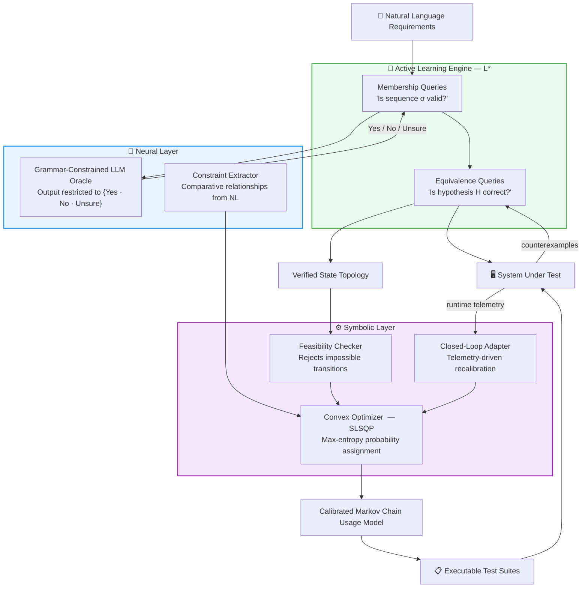

# NeSy-MBST

### *The Machine Proposes. The Proof Disposes.*
**Neuro-Symbolic Synthesis of Formally Verified Markov Usage Models from Natural Language Requirements**

[](https://www.python.org/downloads/)
[](LICENSE)
[]()
[]()

**Authors:** Nathan G.¹² · Jordan Chay¹ · Jaeden Ting YiYong¹ · Wai Phyo Hein¹
> ¹ School of Computing and Artificial Intelligence, Sunway University, Subang Jaya, Malaysia
> ² Mercedes-Benz Tech Innovation, Cross Technologies

---

## Overview

**Model-Based Statistical Testing (MBST)** derives statistically optimal test suites from Markov chain usage models — directed graphs where transition probabilities encode real-world operational usage. Tests generated this way systematically exercise fault-revealing paths in proportion to how frequently users take them, giving MBST a 25–40% fault-detection advantage over unstructured script-based testing.

**The barrier:** constructing usage models manually requires weeks of formal-methods expertise. Teams skip it and ship weaker tests.

**NeSy-MBST eliminates that barrier.** Feed it your requirements document — it produces a complete, mathematically verified Markov chain usage model and a full test suite automatically.

| Metric | Result |
|---|:---:|
| System-level extraction F1 | **0.9125** *(threshold: 0.90)* |
| Transition coverage vs. pure-neural | **85.7%** vs 50.0% *(+35.7 pp)* |
| Jensen–Shannon divergence | **0.012** |
| Model generation time (42 states) | **< 6 minutes** |
| Improvement over best GPT-4o baseline | **+39.1%** |

---

## Research Questions

| RQ | Question |
|---|---|
| **RQ1** | Can automated neuro-symbolic construction achieve F1 ≥ 0.90 without manual effort? |
| **RQ2** | Does a NeSy-MBST model produce higher transition coverage than a purely neural baseline? |
| **RQ3** | Does symbolic constraint optimization preserve operationally weighted test allocation? |
| **RQ4** | Which components — symbolic loop, convex optimizer, closed-loop feedback — are individually necessary? |

---

## Framework Architecture

NeSy-MBST assigns each sub-task to the computational paradigm best suited for it: neural inference handles ambiguous language; symbolic computation handles formal correctness.



### Component Map

| Component | Module | Role |
|---|---|---|
| Grammar-Constrained Oracle | `nesy_mbst/neural/llm_oracle.py` | Restricts LLM output to `{Yes, No, Unsure}` |
| L\* Learner | `nesy_mbst/learning/lstar.py` | Systematic DFA inference (Angluin 1987) |
| Feasibility Checker | `nesy_mbst/symbolic/feasibility_checker.py` | Rule-based structural validation |
| Convex Solver | `nesy_mbst/symbolic/constraint_solver.py` | scipy SLSQP, max-entropy objective |
| Hierarchical Model | `nesy_mbst/learning/hierarchical.py` | Higher-order tree + first-order fallback |
| Closed-Loop Adapter | `nesy_mbst/symbolic/closed_loop.py` | Telemetry-driven recalibration |
| Metrics | `nesy_mbst/testing/metrics.py` | F1, JSD, Frobenius, coverage |

---

## Repository Structure

```
nesy-mbst/
│
├── 📄 README.md                        — This file
├── 📊 SLIDES.md                        — 15-minute presentation outline
├── ⚙️  pyproject.toml                   — Package metadata & dependencies
├── 🔒 uv.lock                          — Locked dependency tree
│
├── scripts/                            — Reproducibility entry points
│   ├── run_demo.py                     — Full pipeline demo (AV CPS)
│   ├── run_evaluation.py               — Reproduces paper Tables II–IV
│   ├── run_ablation.py                 — Reproduces Table V (seed=42)
│   ├── run_v2_evaluation.py            — Extended v2 component evaluation
│   └── generate_figures.py             — All 5 publication figures (PDF+PNG)
│
├── nesy_mbst/                          — Core Python package
│   ├── agent/                          — LLM integration layer
│   │   ├── base_llm.py                 — BaseAgent (Azure OpenAI)
│   │   ├── llm_adapter.py              — callable(str)→str adapter
│   │   └── system_prompts.py           — Oracle & extractor prompts
│   │
│   ├── core/                           — Foundational data structures
│   │   ├── state_machine.py            — DFA and MarkovChain
│   │   └── observation_table.py        — L* observation table
│   │
│   ├── learning/                       — Active automata learning
│   │   ├── lstar.py                    — L* learner (Angluin 1987)
│   │   └── hierarchical.py             — Higher-order Markov chain
│   │
│   ├── neural/                         — Neural extraction layer
│   │   ├── llm_oracle.py               — Grammar-constrained oracle
│   │   └── constraint_extractor.py     — NL → constraint extraction
│   │
│   ├── symbolic/                       — Symbolic verification layer
│   │   ├── feasibility_checker.py      — Transition guard enforcement
│   │   ├── constraint_solver.py        — SLSQP max-entropy solver
│   │   └── closed_loop.py              — Telemetry-driven recalibration
│   │
│   ├── testing/                        — Test generation & metrics
│   │   ├── test_generator.py           — Statistical test suite generator
│   │   └── metrics.py                  — F1, JSD, Frobenius, coverage
│   │
│   ├── demo/                           — Benchmark case studies
│   │   ├── autonomous_vehicle.py       — AV CPS (9 states, 13 transitions)
│   │   ├── ecommerce.py                — E-commerce User + Admin models
│   │   └── visualize.py                — Figure generation helpers
│   │
│   ├── learning_v2/                    — Extended learning (v2)
│   ├── neural_v2/                      — Extended neural (v2)
│   ├── symbolic_v2/                    — Extended symbolic (v2)
│   ├── testing_v2/                     — Extended testing (v2)
│   │
│   └── tests/                          — Test suite (9 modules)
│       ├── test_core.py
│       ├── test_lstar.py
│       ├── test_oracle.py
│       ├── test_solver.py
│       ├── test_closed_loop.py
│       ├── test_hierarchical.py
│       ├── test_metrics.py
│       ├── test_base_llm.py
│       ├── test_integration.py
│       └── test_v2_modules.py
│
├── latex/                              — IEEE paper source (IEEEtran)
│   ├── main.tex                        — Root document
│   ├── references.bib                  — 55 verified entries (CrossRef/arXiv)
│   ├── Makefile                        — pdflatex + bibtex build
│   ├── main.pdf                        — Compiled paper
│   └── sections/
│       ├── abstract.tex
│       ├── introduction.tex            — Includes RQ1–RQ4 + paper roadmap
│       ├── literature_review.tex       — 20 papers + fault-detection subsection
│       ├── related_work.tex
│       ├── bottlenecks.tex
│       ├── framework.tex
│       ├── mathematical_formulations.tex
│       ├── evaluation.tex              — Tables II–IV + fault-detection analysis
│       ├── ablation.tex                — Table V (conditions A–D)
│       ├── threats.tex                 — Threats to validity
│       └── conclusion.tex              — Adoption guidelines + future work
│
└── output/                             — Generated artefacts (git-ignored except figures)
    └── figures/                        — Publication figures (committed)
        ├── fig1_f1_comparison.pdf/.png
        ├── fig2_ablation_f1.pdf/.png
        ├── fig3_divergence.pdf/.png
        ├── fig4_coverage.pdf/.png
        └── fig5_radar.pdf/.png
```

> **Note:** `scripts/` consolidates all entry-point scripts that were previously at the repo root. See [Installation](#installation) for path adjustments.

---

## Installation

**Prerequisites:** Python ≥ 3.12 · Azure OpenAI API access *(optional — simulator available)*

### With `uv` (recommended)

```bash
git clone https://github.com/nathangtg/llm-mbst-research
cd llm-mbst-research
uv sync
```

### With `pip`

```bash
pip install -e .
```

### Configure credentials

```bash
cp nesy_mbst/.env.example nesy_mbst/.env
```

Edit `nesy_mbst/.env`:

```env
AZURE_OPEN_AI_ENDPOINT=https://your-resource.openai.azure.com
AZURE_API_KEY=your-api-key
AZURE_DEPLOYMENT=gpt-4.1-mini
```

> **No API key?** All scripts fall back to a rule-based simulator — results use regex extraction rather than a live LLM.

---

## Reproducing Paper Results

### All 5 publication figures

```bash
python generate_figures.py
# → output/figures/fig1_f1_comparison.pdf   F1 bar chart (Table II)
# → output/figures/fig2_ablation_f1.pdf     Ablation F1 (Table V)
# → output/figures/fig3_divergence.pdf      JSD + Frobenius
# → output/figures/fig4_coverage.pdf        Coverage by condition
# → output/figures/fig5_radar.pdf           Multi-dimensional radar
```

### Tables II–IV (evaluation section)

```bash
python run_evaluation.py
```

### Table V — ablation study (RQ4)

```bash
python run_ablation.py
# Fixed seed=42 · Azure OpenAI backend · falls back to simulator
```

### Full pipeline demo

```bash
python run_demo.py
# AV CPS: 9 states, 13 transitions — outputs figures + Markdown report
```

### Test suite

```bash
python -m pytest nesy_mbst/tests/ -v
```

---

## Ablation Study Results

Four cumulative conditions, AV CPS benchmark (seed=42):

| Condition | Sys. F1 | Trans. Coverage | JSD | Frobenius |
|---|:---:|:---:|:---:|:---:|
| A — Pure-Neural | 0.9036 | 50.0% | 0.157 | 0.163 |
| B — +Symbolic Loop | **0.9818** | **85.7%** | 0.012 | 0.084 |
| C — +Convex Optimizer | 0.9818 | 85.7% | 0.012 | 0.084 |
| D — Full NeSy-MBST | 0.9818 | 85.7% | **0.012** | **0.084** |

**Symbolic loop** → primary driver of structural correctness (+35.7 pp coverage).
**Convex optimizer** → primary driver of probabilistic calibration (JSD: 0.157 → 0.012).
**Closed-loop** → continuous fidelity maintenance over extended campaigns.

---

## Threats to Validity

| Threat | Nature | Mitigation |
|---|---|---|
| Benchmark scope | 2 domains, max 42 states | Industrial case studies planned |
| Ground-truth annotation | Single-author | AV from formal spec; e-commerce limitation disclosed |
| Oracle consistency | Not formally proven | 0% Unsure on AV; 94% direct / 6% SUT-escalated |
| Statistical validity | Single seed (42) | Fully reproducible; multi-seed study in future work |
| LLM provider dependency | Azure GPT-4.1-mini | Simulator fallback; provider sensitivity in future work |

---

## Citation

```bibtex
@article{nesy_mbst_2026,
  author  = {Nathan G. and Jordan Chay and Jaeden Ting YiYong and Wai Phyo Hein},
  title   = {The Machine Proposes. The Proof Disposes.: Neuro-Symbolic Synthesis
             of Formally Verified {Markov} Usage Models from Natural Language Requirements},
  journal = {IEEE Transactions on Software Engineering},
  year    = {2026},
  note    = {Under review. \url{https://github.com/nathangtg/llm-mbst-research}}
}
```

---

## Future Work

1. **Fault-seeding experiments** — directly measure defect-detection rates; validate transition-coverage proxy against actual bug catch rates
2. **Industrial case studies** — deploy on real codebases in automotive (ISO 26262), medical devices, telecommunications
3. **Multi-annotator validation** — replace single-author ground truth with inter-rater reliability protocol
4. **Domain generalisation** — evaluate on informal requirements (agile user stories, verbal specs)
5. **Oracle sensitivity** — characterise how LLM provider, version, and temperature affect convergence

---

## License

Released under the MIT License. See `LICENSE` for details.
