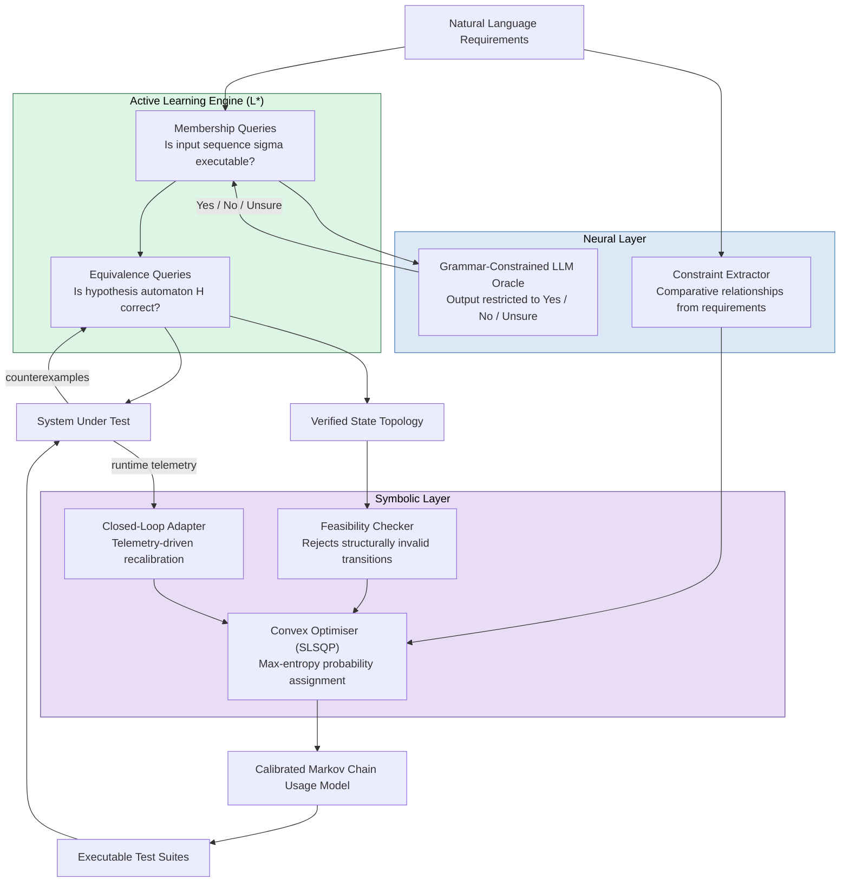

# NeSy-MBST

### *The Machine Proposes. The Proof Disposes.*
**Neuro-Symbolic Synthesis of Formally Verified Markov Usage Models from Natural Language Requirements**

[](https://www.python.org/downloads/)
[](LICENSE)
[]()

**Author:** Nathan G.<sup>1,2</sup> 

<sup>1</sup> School of Computing and Artificial Intelligence, Sunway University, Subang Jaya, Malaysia  
<sup>2</sup> Mercedes-Benz Tech Innovation

**Contributors:** 
*   **Proofreading:** Jordan Chay, Jaeden Ting YiYong, Wai Phyo Hein
---

## Overview

**Model-Based Statistical Testing (MBST)** derives statistically optimal test suites from Markov chain usage models — directed graphs where transition probabilities encode real-world operational usage. Tests generated this way systematically exercise fault-revealing paths in proportion to how frequently users take them, giving MBST a 25–40% fault-detection advantage over unstructured script-based testing.

The adoption barrier is the construction of those models: translating requirements into a verified, row-stochastic Markov chain requires formal-methods expertise that most teams do not have.

**NeSy-MBST eliminates that barrier.** It reads a natural-language requirements document and produces a complete, mathematically verified usage model and test suite automatically.

| Metric | Result |
|---|:---:|
| System-level extraction F1 | **0.9125** *(safety-critical threshold: 0.90)* |
| Transition coverage vs. pure-neural baseline | **85.7%** vs 50.0% (+35.7 pp) |
| Jensen–Shannon divergence | **0.012** |
| Model generation time (42-state model) | **< 6 minutes** |
| Improvement over best GPT-4o baseline | **+39.1%** |

---

## Research Questions

| | Question |
|---|---|
| **RQ1** | Can automated neuro-symbolic construction achieve F1 ≥ 0.90 for safety-critical test generation without manual modelling effort? |
| **RQ2** | Does a NeSy-MBST-generated model produce higher transition coverage than a purely neural baseline, and does this translate into broader fault-revealing path diversity? |
| **RQ3** | Does symbolic constraint optimisation preserve operationally weighted test allocation (probabilistic calibration)? |
| **RQ4** | Which architectural components — symbolic verification loop, convex optimiser, closed-loop feedback — are individually necessary, and which failure modes does each address? |

---

## Framework Architecture

NeSy-MBST separates concerns by computational capability: the neural layer handles ambiguous natural language; the symbolic layer enforces formal correctness and mathematical calibration.



### Component Map

| Component | Module | Role |
|---|---|---|
| Grammar-Constrained Oracle | `nesy_mbst/neural/llm_oracle.py` | Restricts LLM output to `{Yes, No, Unsure}`; escalates `Unsure` to SUT |
| L\* Learner | `nesy_mbst/learning/lstar.py` | Systematic DFA inference (Angluin 1987) |
| Feasibility Checker | `nesy_mbst/symbolic/feasibility_checker.py` | Rule-based structural validation against invariants |
| Convex Solver | `nesy_mbst/symbolic/constraint_solver.py` | scipy SLSQP with row-stochastic bounds, max-entropy objective |
| Hierarchical Model | `nesy_mbst/learning/hierarchical.py` | Higher-order Markov tree + first-order exception fallback |
| Closed-Loop Adapter | `nesy_mbst/symbolic/closed_loop.py` | Detects model drift; recalibrates transition probabilities |
| Metrics | `nesy_mbst/testing/metrics.py` | F1, JSD, Frobenius distance, state/transition coverage |

---

## Repository Structure

```
nesy-mbst/
|
+-- README.md                           Project documentation
+-- SLIDES.md                           15-minute presentation outline (SWE3033)
+-- pyproject.toml                      Package metadata and dependencies
+-- uv.lock                             Locked dependency tree
|
+-- scripts/                            Reproducibility entry points
|   +-- run_demo.py                     Full pipeline demo (AV CPS case study)
|   +-- run_evaluation.py               Reproduces paper Tables II-IV
|   +-- run_ablation.py                 Reproduces Table V, ablation study (seed=42)
|   +-- run_v2_evaluation.py            Extended v2 component evaluation
|   \-- generate_figures.py             Generates all 5 publication figures (PDF+PNG)
|
+-- nesy_mbst/                          Core Python package
|   +-- agent/                          LLM integration layer
|   |   +-- base_llm.py                 BaseAgent abstract class (Azure OpenAI)
|   |   +-- llm_adapter.py              callable(str)->str adapter
|   |   \-- system_prompts.py           Oracle and constraint-extractor prompts
|   |
|   +-- core/                           Foundational data structures
|   |   +-- state_machine.py            DFA and MarkovChain classes
|   |   \-- observation_table.py        L* observation table
|   |
|   +-- learning/                       Active automata learning
|   |   +-- lstar.py                    L* learner (Angluin 1987)
|   |   \-- hierarchical.py             Higher-order Markov chain model
|   |
|   +-- neural/                         Neural extraction layer
|   |   +-- llm_oracle.py               Grammar-constrained membership oracle
|   |   \-- constraint_extractor.py     NL to operational constraint extraction
|   |
|   +-- symbolic/                       Symbolic verification and calibration
|   |   +-- feasibility_checker.py      Transition guard and invariant enforcement
|   |   +-- constraint_solver.py        SLSQP max-entropy convex solver
|   |   \-- closed_loop.py              Telemetry-driven model recalibration
|   |
|   +-- testing/                        Test generation and evaluation metrics
|   |   +-- test_generator.py           Statistical test suite generator
|   |   \-- metrics.py                  F1, JSD, Frobenius distance, coverage
|   |
|   +-- demo/                           Benchmark case studies
|   |   +-- autonomous_vehicle.py       AV CPS benchmark (9 states, 13 transitions)
|   |   +-- ecommerce.py                E-commerce User and Admin models
|   |   \-- visualize.py                Figure generation helpers
|   |
|   +-- learning_v2/                    Extended learning components (v2)
|   +-- neural_v2/                      Extended neural components (v2)
|   +-- symbolic_v2/                    Extended symbolic components (v2)
|   +-- testing_v2/                     Extended testing components (v2)
|   |
|   \-- tests/                          Unit and integration test suite
|       +-- test_core.py
|       +-- test_lstar.py
|       +-- test_oracle.py
|       +-- test_solver.py
|       +-- test_closed_loop.py
|       +-- test_hierarchical.py
|       +-- test_metrics.py
|       +-- test_base_llm.py
|       +-- test_integration.py
|       \-- test_v2_modules.py
|
+-- latex/                              IEEE paper source (IEEEtran format)
|   +-- main.tex                        Root document
|   +-- references.bib                  55 verified entries (CrossRef and arXiv API)
|   +-- Makefile                        pdflatex + bibtex build
|   +-- main.pdf                        Compiled paper (committed artefact)
|   \-- sections/
|       +-- abstract.tex
|       +-- introduction.tex            Research questions RQ1-RQ4 and paper roadmap
|       +-- literature_review.tex       20-paper review with fault-detection subsection
|       +-- related_work.tex
|       +-- bottlenecks.tex
|       +-- framework.tex
|       +-- mathematical_formulations.tex
|       +-- evaluation.tex              Tables II-IV and fault-detection proxy analysis
|       +-- ablation.tex                Table V, conditions A-D
|       +-- threats.tex                 Threats to validity
|       \-- conclusion.tex              Adoption guidelines and future work
|
\-- output/                             Generated artefacts (git-ignored except figures)
    \-- figures/                        Publication figures (committed)
        +-- fig1_f1_comparison.pdf/.png
        +-- fig2_ablation_f1.pdf/.png
        +-- fig3_divergence.pdf/.png
        +-- fig4_coverage.pdf/.png
        \-- fig5_radar.pdf/.png
```

---

## Installation

**Prerequisites:** Python 3.12 or later. Azure OpenAI API access is optional; a rule-based simulator is available for offline use.

### Recommended: uv

```bash
git clone https://github.com/nathangtg/llm-mbst-research
cd llm-mbst-research
uv sync
```

### Alternative: pip

```bash
pip install -e .
```

### Credentials

```bash
cp nesy_mbst/.env.example nesy_mbst/.env
```

Edit `nesy_mbst/.env`:

```env
AZURE_OPEN_AI_ENDPOINT=https://your-resource.openai.azure.com
AZURE_API_KEY=your-api-key
AZURE_DEPLOYMENT=gpt-4.1-mini
```

If no API credentials are provided, all scripts fall back to the built-in rule-based oracle simulator.

---

## Reproducing Paper Results

All commands are run from the repository root.

### Publication figures (Figures 1–5)

```bash
python scripts/generate_figures.py
```

Outputs to `output/figures/`:

| File | Content |
|---|---|
| `fig1_f1_comparison.pdf` | Grouped bar chart — F1 across all six strategies (Table II) |
| `fig2_ablation_f1.pdf` | Ablation F1 scores by condition (Table V) |
| `fig3_divergence.pdf` | JSD and Frobenius distance by ablation condition |
| `fig4_coverage.pdf` | Transition and state coverage by ablation condition |
| `fig5_radar.pdf` | Multi-dimensional radar chart, NeSy-MBST vs. baselines |

### Tables II–IV (evaluation section)

```bash
python scripts/run_evaluation.py
```

### Table V — ablation study (RQ4)

```bash
python scripts/run_ablation.py
# Fixed seed=42. Uses Azure OpenAI if credentials are configured; otherwise simulator.
```

### Full pipeline demo

```bash
python scripts/run_demo.py
# Runs the AV CPS case study end-to-end and writes figures and a Markdown report to output/
```

### Test suite

```bash
python -m pytest nesy_mbst/tests/ -v
```

---

## Ablation Study Results

Cumulative conditions evaluated on the Autonomous Vehicle CPS benchmark (seed = 42):

| Condition | Sys. F1 | Trans. Coverage | JSD | Frobenius |
|---|:---:|:---:|:---:|:---:|
| A — Pure-Neural | 0.9036 | 50.0% | 0.157 | 0.163 |
| B — +Symbolic Loop | **0.9818** | **85.7%** | 0.012 | 0.084 |
| C — +Convex Optimiser | 0.9818 | 85.7% | 0.012 | 0.084 |
| D — Full NeSy-MBST | 0.9818 | 85.7% | **0.012** | **0.084** |

The symbolic feasibility loop is the primary driver of structural correctness and coverage (+35.7 percentage points, A to B). The convex optimiser is the primary driver of probabilistic calibration (JSD: 0.157 to 0.012, B to C). The closed-loop adapter provides continuous fidelity maintenance over extended test campaigns (C to D).

---

## Threats to Validity

| Dimension | Concern | Mitigation |
|---|---|---|
| Construct validity | Reference model uses randomly seeded probabilities, not empirical operational data | Disclosed in paper Section IX; telemetry-based reference planned for future work |
| Construct validity | Single-author ground-truth annotation | AV benchmark derived from formal specification; e-commerce tautology disclosed |
| Internal validity | Oracle consistency not formally proven for three-valued responses | 0% Unsure rate on AV benchmark; 94% direct resolution, 6% escalated to SUT |
| External validity | Two domains evaluated, maximum 42 states | Industrial case studies identified as primary future work |
| Statistical validity | Single random seed (42) | Implementation is deterministic and fully reproducible |

---

## Citation

```bibtex
@article{nesy_mbst_2026,
  author  = {Nathan Aldyth Prananta G.},
  title   = {The Machine Proposes. The Proof Disposes.: Neuro-Symbolic Synthesis
             of Formally Verified {Markov} Usage Models from Natural Language
             Requirements},
  year    = {2026},
  note    = {Under review. Available: https://github.com/nathangtg/llm-mbst-research}
}
```

---

## Future Work

1. **Fault-seeding experiments** — directly measure defect-detection rates against a seeded or historical fault corpus to validate the transition-coverage proxy used in this paper.
2. **Industrial case studies** — deploy on production codebases in automotive (ISO 26262), medical devices, and telecommunications protocol stacks.
3. **Multi-annotator validation** — replace single-author ground-truth annotation with a formal inter-rater reliability protocol.
4. **Domain generalisation** — evaluate on informally-written requirements such as agile user stories and verbal specifications.
5. **Oracle sensitivity analysis** — characterise how LLM provider, model version, and temperature setting affect convergence speed and extraction F1.

---

## License

Released under the MIT License. See `LICENSE` for details.
