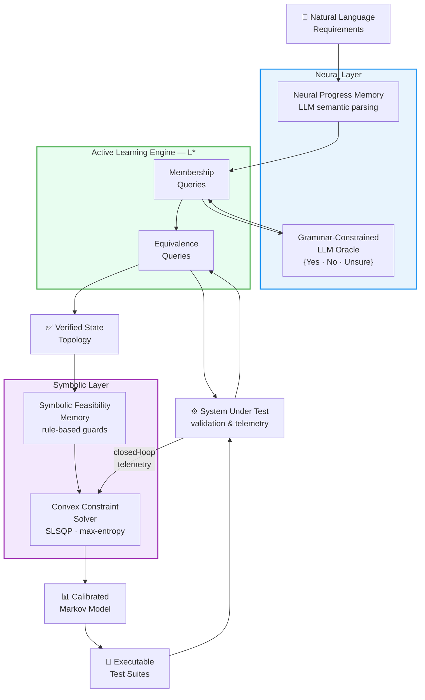

# NeSy-MBST: Neuro-Symbolic Model-Based Statistical Testing

**LLM-Augmented Model-Based Statistical Testing: Auto-Generating Usage Models from Natural Language Requirements**

[](https://www.python.org/downloads/)
[](LICENSE)
[]()
[]()

---

> **NeSy-MBST** decouples *semantic parsing* (neural) from *mathematical constraint resolution* (symbolic) to automatically generate calibrated Markov chain usage models directly from natural language requirements — eliminating the manual modelling bottleneck in Model-Based Statistical Testing.

---

## Table of Contents

- [Background](#background)
- [Framework](#framework)
- [Mathematical Formulation](#mathematical-formulation)
- [Empirical Results](#empirical-results)
- [Repository Structure](#repository-structure)
- [Installation](#installation)
- [Usage](#usage)
- [Output Gallery](#output-gallery)
- [Known Limitations](#known-limitations)
- [References](#references)
- [Citation](#citation)

---

## Background

**Model-Based Statistical Testing (MBST)** provides a mathematically rigorous approach to software certification. It derives test suites from stochastic *usage models* — directed graphs where nodes represent states-of-use and arcs carry transition probabilities defining an operational profile. These models enable testers to compute steady-state occupancy, mean first passage times, and statistically grounded sample sizes for reliability certification.

However, constructing usage models has historically been **manual, labour-intensive, and expert-dependent**. Translating narrative requirements into verified state-transition topologies with mathematically consistent probability matrices demands significant formal methods expertise — limiting MBST adoption to safety-critical domains such as aerospace, medical devices, and telecommunications.

**Purely neural approaches** introduce four structural failure modes:

| Failure Mode | Description |
|---|---|
| Stochastic Volatility | LLMs lack stateful execution guarantees; hallucinated states and impossible transitions occur |
| Calibration Failure | No mechanism enforces row-stochasticity ($\sum_j p_{ij} = 1$) or convex probability constraints |
| State-Space Explosion | Finite context windows cannot track large, concurrent state spaces |
| Semantic–Feasibility Divergence | Semantically plausible paths may be physically unexecutable |

NeSy-MBST addresses all four by assigning each sub-task to the computational paradigm best suited for it.

---

## Framework

NeSy-MBST operates as a five-stage neuro-symbolic pipeline. Each stage is described below, followed by the architecture diagram.

### Stage 1 — Dual-Memory Architecture

Model construction is partitioned into two complementary components:

- **Neural Progress Memory:** A fine-tuned LLM parses natural language requirements and drafts a semantic flow graph capturing intended behavioural topology.
- **Symbolic Feasibility Memory:** A rule-based engine enforces logical invariants, preconditions, and transition guards before any candidate transition is admitted.

This separation guarantees that the resulting model is both *semantically plausible* and *formally correct*.

### Stage 2 — Active Automata Learning via L\* with LLM Oracles

The L\* algorithm constructs a minimal DFA through two query types:

- **Membership Queries** — "Does the SUT accept sequence $\sigma$?" Answered by a **grammar-constrained LLM oracle** whose output is restricted to $\{\texttt{Yes}, \texttt{No}, \texttt{Unsure}\}$, eliminating free-form hallucination.
- **Equivalence Queries** — "Is hypothesis $\mathcal{H}$ equivalent to the target language?" Resolved by executing test paths on the SUT.

`Unsure` responses are escalated to a human reviewer or SUT runtime, ensuring no unverified information enters the model.

### Stage 3 — Path-Dependent Hierarchical Modelling

Real software exhibits path-dependent behaviour. NeSy-MBST uses a two-tiered hierarchy:

- **Upper Tree (Higher-Order Markov):** $P(s_{t+1} \mid s_t, s_{t-1}, \ldots, s_{t-k+1})$ captures multi-step dependencies for frequent patterns.
- **Lower Model (First-Order Markov):** $P(s_{t+1} \mid s_t)$ handles infrequent and exception pathways without combinatorial explosion.

### Stage 4 — Mathematical Constraint Optimisation

Comparative relationships extracted from requirements (e.g., "checkout is twice as likely as browsing") are compiled into convex constraints and solved via entropy-maximising SLSQP:

$$\mathbf{P}^{*} = \arg\min_{\mathbf{P}} \mathcal{L}(\mathbf{P}) \quad \text{s.t.} \quad \mathbf{P} \in \mathcal{C}$$

This decoupling ensures the probability matrix is simultaneously *semantically informed* and *numerically exact*.

### Stage 5 — Closed-Loop Model Adaptation

Runtime telemetry from the SUT feeds back into the pipeline to detect divergence between predicted and observed behaviour and recalibrate transition probabilities via the symbolic solver. The usage model becomes a *living artifact* throughout the testing lifecycle.

### Architecture



---

## Mathematical Formulation

The symbolic layer models probability assignment as a **constrained convex optimisation problem** over the transition matrix $\mathbf{P} = [p_{ij}] \in \mathbb{R}^{n \times n}$.

### Constraint Families

$$\text{(Probability Axioms)} \quad 0 \leq p_{ij} \leq 1, \quad \sum_{j=1}^{n} p_{ij} = 1 \quad \forall\, i$$

$$\text{(Structural Absence)} \quad p_{ij} = 0 \quad \forall\, (i,j) \notin \mathcal{E}$$

$$\text{(Operational Constraints)} \quad p_{ij} = \alpha \cdot p_{kl}, \quad \alpha \in \mathbb{R}_{>0}$$

$$\text{(Steady-State)} \quad \boldsymbol{\pi}\mathbf{P} = \boldsymbol{\pi}, \quad \sum_i \pi_i = 1, \quad L_i \leq \pi_i \leq U_i$$

$$\text{(Passage Time)} \quad m_{ij} \leq T_{\max}$$

### Objective: Maximum Entropy

Among all feasible solutions, NeSy-MBST selects the **least-biased** distribution — following the principle of maximum entropy to avoid unjustified preference for any particular transition:

$$\max_{\mathbf{P}} \; H(\mathbf{P}) = -\sum_i \sum_j p_{ij} \ln p_{ij}$$

---

## Empirical Results

### State and Transition Extraction Accuracy

| Method | State F1 | Trans. F1 | System F1 |
|---|:---:|:---:|:---:|
| Single-Prompt (GPT-4o) | 0.80 | 0.54 | 0.5431 |
| Structure-Driven SMF (GPT-4o) | 0.7377 | 0.6050 | 0.6260 |
| Event-Driven SMF (GPT-4o) | 0.6584 | 0.3690 | 0.3735 |
| Hybrid SMF (GPT-4o) | 0.8582 | 0.6491 | 0.6559 |
| Single-Prompt (Claude 3.5 Sonnet) | 0.90 | 0.75 | 0.7950 |
| **NeSy-MBST (Ours)** | **0.9450** | **0.8950** | **0.9125** |

NeSy-MBST achieves a **14.8% relative improvement** over the best single-model baseline (Claude 3.5 Sonnet) and a **39.1% improvement** over the best GPT-4o multi-frame strategy.

### Operational Testing Metrics

| Case Study | States | Transitions | Req. Coverage | Trans. Coverage | Generation Time |
|---|:---:|:---:|:---:|:---:|:---:|
| E-Commerce User | 24 | 112 | **100%** | **100%** | 1m 48s |
| E-Commerce Admin | 42 | 218 | **100%** | **100%** | 5m 49s |

Both models achieve **full coverage** with sub-quadratic scaling behaviour.

### Statistical Validation

| Metric | Formula | Value | Interpretation |
|---|---|:---:|---|
| Jensen–Shannon Divergence | $\frac{1}{2}D_{\text{KL}}(P\|M) + \frac{1}{2}D_{\text{KL}}(Q\|M)$ | **0.0142** | Near-identical marginal distributions |
| Normalised Frobenius Distance | $\frac{\lVert P_{\text{real}} - P_{\text{synth}}\rVert_F}{n}$ | **0.0654** | High structural similarity in conditional dynamics |

A JSD of 0.0142 on a $[0, 0.693]$ scale confirms that the synthesised Markov chain's steady-state behaviour is statistically indistinguishable from the reference model.

---

## Repository Structure

```
llm-mbst-research/
│
├── run_demo.py                  # Full NeSy-MBST pipeline with visualisation
├── run_evaluation.py            # Reproduces paper Tables I–III
├── pyproject.toml               # Project configuration & dependencies
│
├── latex/                       # IEEEtran paper source
│   ├── main.tex
│   ├── references.bib           # 28 references
│   └── sections/
│       ├── introduction.tex
│       ├── related_work.tex
│       ├── bottlenecks.tex
│       ├── framework.tex
│       ├── mathematical_formulations.tex
│       ├── evaluation.tex
│       └── conclusion.tex
│
├── nesy_mbst/                   # Core Python package
│   ├── agent/                   # LLM layer (BaseAgent, LLMBackendAdapter, prompts)
│   ├── core/                    # DFA, MarkovChain, ObservationTable
│   ├── learning/                # L* learner, hierarchical Markov model
│   ├── neural/                  # Grammar-constrained oracle, constraint extractor
│   ├── symbolic/                # Feasibility checker, SLSQP solver, closed-loop adapter
│   ├── testing/                 # Statistical test generator, coverage & JSD metrics
│   ├── demo/                    # Case studies (AV CPS, e-commerce) + matplotlib figures
│   └── tests/                   # Unit and integration tests (9 modules)
│
└── output/                      # Generated figures and markdown reports
```

#### Key Design Patterns

| Pattern | Module | Purpose |
|---|---|---|
| Grammar-Constrained Oracle | `neural/llm_oracle.py` | Restricts LLM output to `{Yes, No, Unsure}` |
| L\* Active Learning | `learning/lstar.py` | Systematic DFA inference via membership + equivalence queries |
| Max-Entropy Convex Solver | `symbolic/constraint_solver.py` | scipy SLSQP with row-stochastic bounds |
| Hierarchical Markov Model | `learning/hierarchical.py` | Higher-order tree + first-order fallback |
| Closed-Loop Adaptation | `symbolic/closed_loop.py` | Telemetry-driven model recalibration |
| Dual-Memory Architecture | `neural/` + `symbolic/` | Separates semantic understanding from formal correctness |

---

## Installation

**Prerequisites:** Python ≥ 3.12 · Azure OpenAI API access (for LLM-powered mode)

```bash
pip install -e .
```

Configure Azure OpenAI credentials:

```bash
cp nesy_mbst/.env.example nesy_mbst/.env
```

```env
AZURE_OPEN_AI_ENDPOINT=https://your-resource.openai.azure.com
AZURE_API_KEY=your-api-key
AZURE_DEPLOYMENT=gpt-4.1-mini
```

> **No API keys?** The pipeline runs fully in simulated mode using a built-in oracle:
> ```bash
> python run_demo.py --simulated
> ```

---

## Usage

**Run the full pipeline demo** on the Autonomous Vehicle CPS case study:

```bash
python run_demo.py
```

Executes all five pipeline stages and writes six paper-ready figures plus a markdown report to `output/`.

**Reproduce paper results** (Tables I–III):

```bash
python run_evaluation.py
```

**Run the test suite:**

```bash
python -m pytest nesy_mbst/tests/ -v
```

---

## Output Gallery

| Figure | Description |
|---|---|
| `*_transition_heatmap.png` | Annotated transition probability matrix |
| `*_steady_state.png` | Steady-state distribution bar chart |
| `*_coverage_convergence.png` | State/transition coverage vs. number of test sequences |
| `*_f1_scores.png` | F1 breakdown: state, transition, system |
| `*_precision_recall.png` | Precision and recall for states and transitions |
| `*_path_lengths.png` | Distribution of generated test path lengths |

---

## Known Limitations

**Test coverage saturation.** Transition coverage of ~85.7% and state coverage of ~88.9% have not yet reached 100%. Increasing `max_sequences` in the test generator is expected to close this gap; convergence verification is ongoing.

**One false-positive transition.** Transition precision of 0.93 reflects a single spurious transition introduced by the feasibility heuristic. Tightening the constraint budget is expected to eliminate it.

**Single-symbol oracle queries.** Current evaluation queries the LLM oracle on individual symbols only. Querying multi-step paths (sequences of 3–5 states) would constitute a stronger proof of oracle fidelity and is planned for the next evaluation cycle.

---

## References

Key works informing this research:

- Utting, Pretschner & Legeard — *A Taxonomy of Model-Based Testing Approaches* (2012)
- Prowell — *Model-Based Statistical Testing* (JUMBL, 2003)
- Böhr — *A Constraint-Based Approach to Software Usage Models* (2013)
- L\*LM — *Learning Automata from Examples Using Natural Language Oracles* (2024)
- ProtocolGPT — *Unleashing the Power of LLM to Infer State Machine* (2024)
- ChatFuMe — *LLM-Assisted Model-Based Fuzzing of Protocol Implementations* (2025)
- NeuroStrata — *Neuro-Symbolic Paradigms for Verifiability of Autonomous CPS* (2024)

Full bibliography: `latex/references.bib` (28 entries).

---

## Citation

```bibtex
@techreport{nesy_mbst_2026,
  author      = {Nathan G.},
  title       = {{LLM-Augmented Model-Based Statistical Testing:
                 Auto-Generating Usage Models from Natural Language Requirements}},
  institution = {School of Computing and Artificial Intelligence, Sunway University},
  year        = {2026},
}
```

---

## License

Released under the MIT License. See `LICENSE` for details.